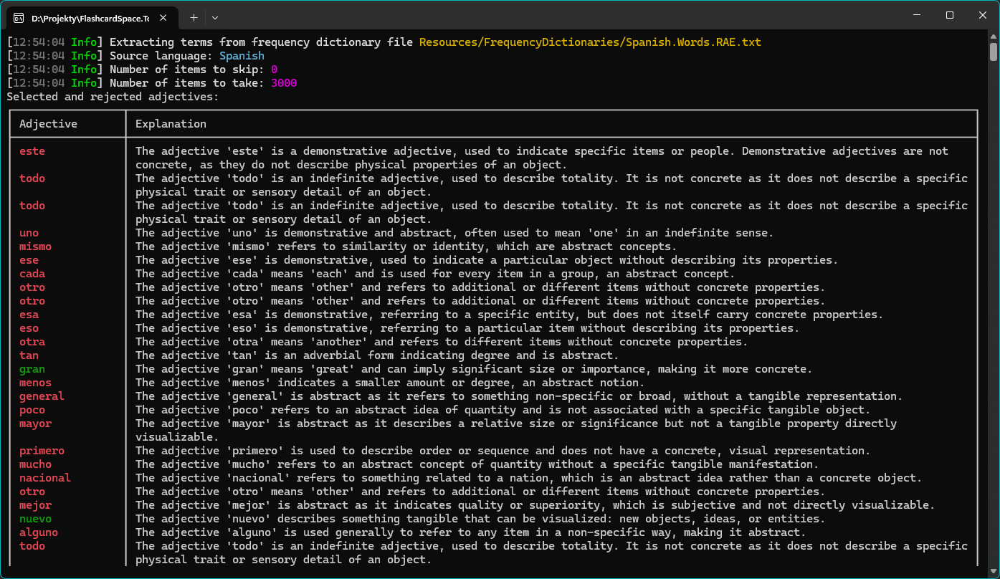
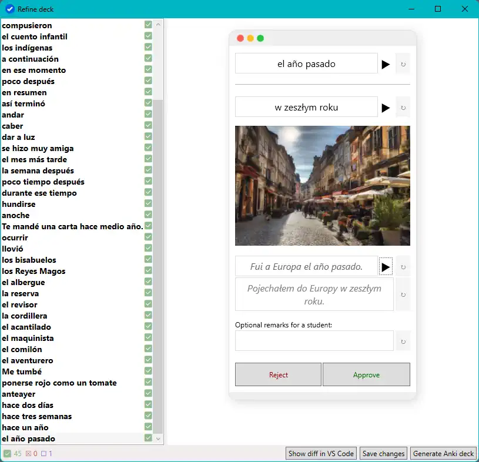
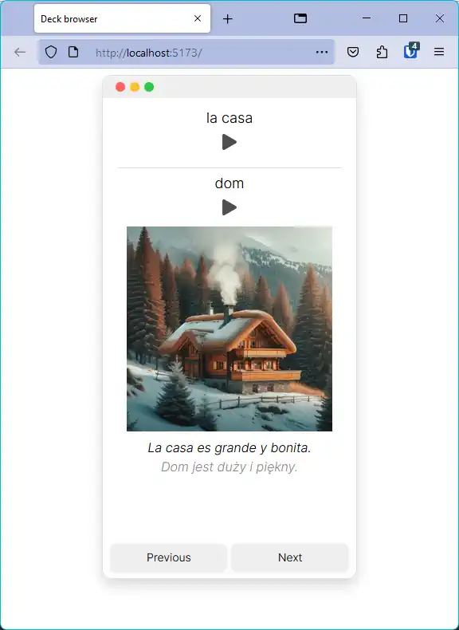

# Flashcard Space toolkit

## About the project

This project contains **authoring tools for creating language learning flashcards**. This toolkit combines the use of Generative AI models with human review to ensure quality.

This is a by-product of my attempts to deliver high-quality flashcards to the Anki community. Example flashcards generated with this tooling are available at [flashcard.space](https://flashcard.space).

## The concept in one picture

Here is an oversimplified diagram to show the main idea: 

## Screenshots

Here are a few more screenshots from the alpha versions:

### Flashcard generator

Flashcard generator is a console tool that reads input in various formats and uses Generative AI APIs to analyze it and prepare useful flashcard candidates. 

### Refinement tool

Once flashcard candidates are generated, they are displayed in a review tool for human review and approval.

### Web preview component

To be able to display previews of a deck on websites, the project also contains a web component allowing browsing the flashcards:

## Technical diagram 

Here is a slightly more detailed diagram showing the scope I imagine for this project:

## The status

The project is still in an **experimenting and development** stage. Concepts change every day, and it's a bit chaotic 😅

A fully functional version does not exist yet, but it's being actively worked on! 

So far, in the last months, I have been creating various proofs-of-concept to assess in which areas the work can already be outsourced to Generative AI and which need to be handled manually. Currently, my goal is to combine the variety of tested ideas into a simple toolkit, which would allow transforming input content into high-quality flashcards with minimum interaction needed.

### Milestones:

☑ Create proof-of-concept tools to help authoring language learning flashcards. 
☑ Tidy up the tools and combine them into a simple toolkit. 
☐ **In progress**: Generate and publish the first quality flashcard sets to collect feedback. 
☐ Refactor, add proper documentation and keep the toolkit alive as an open-source project, allowing it to improve and support more languages.

## Documentation

The project is not yet properly documented and not ready for collaboration, but it's one of the future milestones.

[//]: # (If you would like to learn more, run the project on your own machine, or contribute, please take a look at the [Documentation]&#40;docs/Index.md&#41;.)

