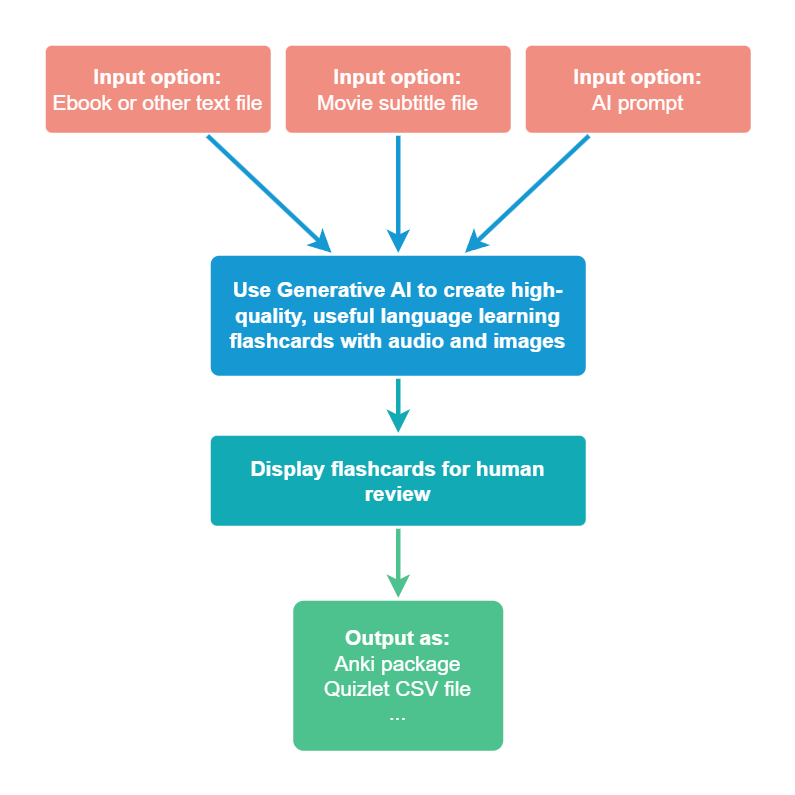

# Flashcard Space toolkit

## The goal of the project 

This project contains **authoring tools for creating language learning flashcards**. This toolkit combines the use of Generative AI models with human review to ensure quality.

This is a by-product of my attempts to deliver high-quality flashcards to the Anki community. Example flashcards generated with this tooling are available at [flashcard.space](https://flashcard.space).

The general idea for how the tooling works is best depicted on a diagram:

## The status of the project

In the last months I have been creating various proofs-of-concept to assess in which areas the work can already be outsourced to Generative AI and which need to be handled manually.

Currently, my goal is to combine the variety of tested ideas into a simple toolkit, which would allow transforming input content into high-quality flashcards with minimum interaction needed. 

☑ Create proof-of-concept tools to help authoring language learning flashcards. 
☐ Tidy up the tools and combine them into a simple toolkit. 
☐ Generate and publish the first quality flashcard sets to collect feedback. 
☐ Keep the toolkit alive as an open-source project, allowing it to improve and support more languages.

## Documentation

If you would like to learn more, run the project on your own machine, or contribute, please take a look at the [Documentation](docs/Index.md).

